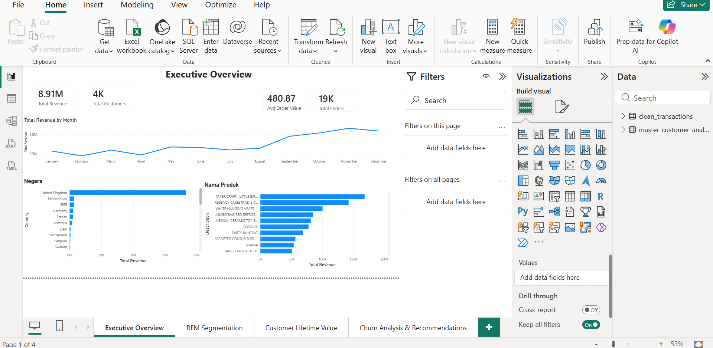
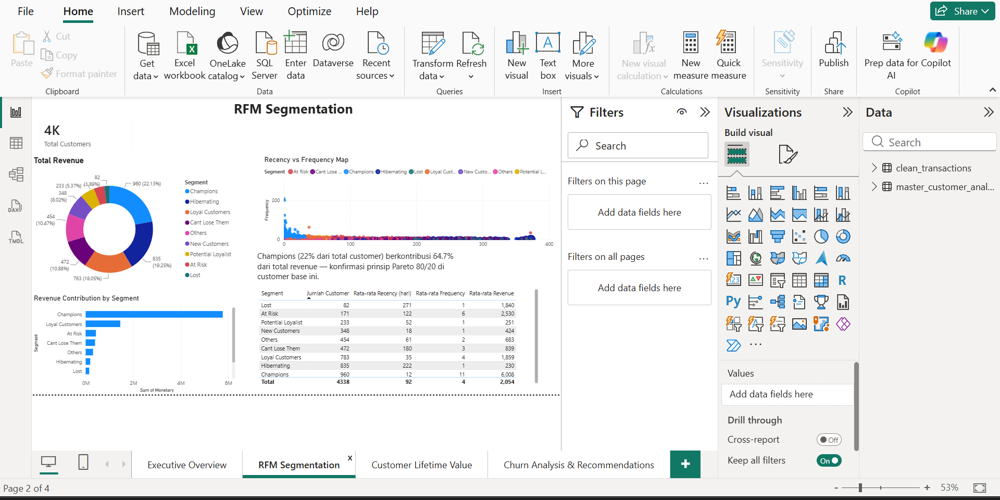
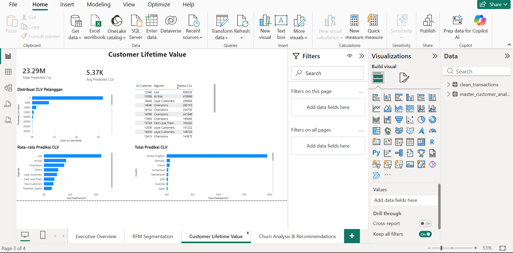

# Customer Analytics: RFM Segmentation, CLV & Churn Analysis

## Project Overview

Project ini adalah analisis customer analytics end-to-end menggunakan **DuckDB (SQL)** untuk data processing dan **Power BI** untuk visualisasi interaktif. Project ini menjawab tiga pertanyaan bisnis utama: siapa pelanggan paling bernilai, berapa nilai jangka panjang mereka, dan mengapa sebagian pelanggan berhenti bertransaksi.

**Tujuan proyek:**
- Melakukan segmentasi pelanggan menggunakan metode RFM (Recency, Frequency, Monetary)
- Menghitung Customer Lifetime Value (CLV) historis dan prediktif tiap pelanggan
- Menganalisis pola churn dan menyusun rekomendasi retensi berbasis data

**Hasil utama yang didapat:**
- 4.338 pelanggan unik berhasil disegmentasi ke dalam 9 kategori RFM
- Segmen **Champions** (22% dari total pelanggan) berkontribusi **64.7%** dari total revenue — mengonfirmasi prinsip Pareto 80/20 pada customer base ini
- Churn rate keseluruhan sebesar **33.4%**, dengan potensi revenue at risk sebesar **£1.04 juta**
- Segmen **"Cant Lose Them"** teridentifikasi sebagai prioritas retensi utama — 87.92% pelanggan di segmen ini sudah churned padahal nilai historisnya tinggi

---

## Business Problem

**Pertanyaan bisnis yang ingin dijawab:**
- Siapa pelanggan paling loyal dan paling berisiko churn?
- Berapa nilai jangka panjang (lifetime value) tiap pelanggan atau segmen pelanggan?
- Mengapa pelanggan berhenti bertransaksi, dan segmen mana yang paling perlu diprioritaskan untuk retention campaign?

**KPI yang dianalisis:**
- Total Revenue, Total Customers, Total Orders, Average Order Value
- RFM Score (Recency, Frequency, Monetary) per pelanggan
- Predicted Customer Lifetime Value (CLV)
- Churn Rate (%) dan Revenue at Risk

**Tujuan analisis:**
Memberikan dasar pengambilan keputusan bagi tim marketing/CRM untuk memprioritaskan strategi retensi, loyalty program, dan win-back campaign berdasarkan nilai dan risiko tiap segmen pelanggan.

---

## Dataset Information

- **Sumber data:** [UCI Machine Learning Repository – Online Retail Dataset](https://archive.ics.uci.edu/dataset/352/online+retail)
- **Periode transaksi:** 1 Desember 2010 – 9 Desember 2011
- **Jumlah baris (raw):** 541.909 baris transaksi
- **Jumlah baris (setelah cleaning):** 397.884 baris
- **Jumlah kolom:** 8 kolom asli (`InvoiceNo`, `StockCode`, `Description`, `Quantity`, `InvoiceDate`, `UnitPrice`, `CustomerID`, `Country`)

**Struktur data akhir (setelah pipeline):**
| Tabel | Level | Jumlah Baris | Keterangan |
|---|---|---|---|
| `clean_transactions` | Level transaksi | 397.884 | Data transaksi bersih, sudah dikonversi tipe data dan divalidasi |
| `master_customer_analytics` | Level pelanggan | 4.338 | Gabungan hasil RFM, CLV, dan Churn Status per pelanggan |

**Relasi antar tabel:** `master_customer_analytics` (1) → `clean_transactions` (banyak), dihubungkan melalui `CustomerID`.

---

## Tools & Technologies

- **SQL (DuckDB v1.5.4)** — data cleaning, transformasi, dan perhitungan RFM/CLV/Churn
- **Power BI Desktop** — pembuatan dashboard interaktif 4 halaman
- **DAX** — pembuatan measures untuk agregasi dinamis di Power BI
- **GitHub** — version control dan portofolio hosting

---

## Data Pipeline

```
Raw Data (Excel, 541,909 rows)
        ↓
Data Profiling (cek missing value, cancelled order, invalid value)
        ↓
Data Cleaning (filter & convert tipe data)
        ↓
Data Transformation (RFM scoring, CLV calculation, Churn flagging)
        ↓
Data Validation (cross-check row count & agregat)
        ↓
Export CSV (master_customer_analytics.csv, clean_transactions.csv)
        ↓
Power BI (import, relationship, DAX measures, visualisasi)
        ↓
Business Insights (dashboard 4 halaman + rekomendasi)
```

---

## Data Profiling

Sebelum cleaning, dilakukan pengecekan kualitas data pada 541.909 baris raw data:

| Isu | Jumlah Baris | Persentase |
|---|---|---|
| `CustomerID` kosong (missing) | 135.080 | ~24.9% |
| Invoice dibatalkan (`InvoiceNo` diawali `C`) | 9.288 | ~1.7% |
| `Quantity` atau `UnitPrice` ≤ 0 (invalid) | 11.805 | ~2.2% |

**Catatan tambahan:**
- Kolom `InvoiceDate` awalnya berupa Excel serial date number, bukan format tanggal standar — memerlukan konversi eksplisit
- Kolom `InvoiceNo` berisi campuran nilai numerik dan kode teks (`C...` untuk cancelled order), sehingga seluruh kolom perlu dibaca sebagai `VARCHAR` terlebih dahulu sebelum tipe data final ditentukan

---

## Data Cleaning Process

**Masalah yang ditemukan:** missing `CustomerID`, cancelled orders, dan nilai `Quantity`/`UnitPrice` tidak valid (lihat Data Profiling di atas), serta `InvoiceDate` dalam format Excel serial date.

**SQL cleaning yang digunakan:**
```sql
CREATE TABLE clean_transactions AS
SELECT
    InvoiceNo,
    StockCode,
    Description,
    TRY_CAST(Quantity AS INTEGER) AS Quantity,
    (TIMESTAMP '1899-12-30' + TRY_CAST(InvoiceDate AS DOUBLE) * INTERVAL '1 day') AS InvoiceDate,
    TRY_CAST(UnitPrice AS DOUBLE) AS UnitPrice,
    TRY_CAST(CustomerID AS INTEGER) AS CustomerID,
    Country,
    TRY_CAST(Quantity AS INTEGER) * TRY_CAST(UnitPrice AS DOUBLE) AS TotalPrice
FROM raw_transactions
WHERE
    CustomerID IS NOT NULL AND CustomerID != ''
    AND InvoiceNo NOT LIKE 'C%'
    AND TRY_CAST(Quantity AS INTEGER) > 0
    AND TRY_CAST(UnitPrice AS DOUBLE) > 0;
```

**Alasan cleaning dilakukan:**
- Baris tanpa `CustomerID` tidak bisa digunakan untuk analisis level pelanggan (RFM/CLV/Churn)
- Cancelled orders (`InvoiceNo` berawalan `C`) bukan representasi pembelian aktual, sehingga akan mendistorsi perhitungan revenue dan frequency
- `Quantity`/`UnitPrice` ≤ 0 adalah data anomali (kemungkinan kesalahan input atau adjustment), bukan transaksi valid

**Hasil setelah cleaning:** dari 541.909 baris menjadi **397.884 baris** (~73.4% data digunakan), dengan rentang tanggal yang tervalidasi sesuai deskripsi dataset asli: 2010-12-01 s/d 2011-12-09.

---

## Data Transformation Process

Transformasi dilakukan bertahap menggunakan kombinasi **CTE**, **Window Functions**, **JOIN**, **CASE WHEN**, dan **Aggregation**:

**1. RFM Base (Aggregation + CTE)**
```sql
CREATE TABLE rfm_base AS
WITH reference_date AS (
    SELECT MAX(InvoiceDate) AS max_date FROM clean_transactions
)
SELECT
    CustomerID,
    DATE_DIFF('day', MAX(InvoiceDate), (SELECT max_date FROM reference_date)) AS Recency,
    COUNT(DISTINCT InvoiceNo) AS Frequency,
    SUM(TotalPrice) AS Monetary
FROM clean_transactions
GROUP BY CustomerID;
```
Recency dihitung relatif terhadap tanggal transaksi terakhir dalam dataset (bukan tanggal hari ini), karena data bersifat historis.

**2. RFM Scoring (Window Function — NTILE)**
```sql
NTILE(5) OVER (ORDER BY Recency DESC) AS R_Score,
NTILE(5) OVER (ORDER BY Frequency ASC) AS F_Score,
NTILE(5) OVER (ORDER BY Monetary ASC) AS M_Score
```
Setiap dimensi diberi skor 1-5. Recency diurutkan terbalik (`DESC`) karena semakin kecil nilai Recency, semakin baik.

**3. Segmentasi (CASE WHEN — Feature Engineering)**
Kombinasi skor RFM dipetakan menjadi 9 label segmen bisnis: *Champions, Loyal Customers, Potential Loyalist, New Customers, At Risk, Cant Lose Them, Hibernating, Lost,* dan *Others*.

**4. Customer Lifetime Value (JOIN + Aggregation)**
```
CLV = Average Order Value × Monthly Purchase Rate × Estimated Lifespan (12 bulan)
```
Tenure pelanggan (`GREATEST(Tenure_Days, 30)`) diberi nilai minimum 30 hari untuk mencegah *division by near-zero* pada pelanggan dengan rentang transaksi sangat pendek — masalah ini ditemukan dan diperbaiki selama proses development (lihat detail query lengkap di `sql/`).

**5. Churn Flagging (CASE WHEN)**
```sql
CASE WHEN Recency > 90 THEN 'Churned' ELSE 'Active' END AS Churn_Status
```
Threshold 90 hari dipilih sebagai definisi churn standar untuk konteks retail non-subscription.

**6. Master Table (JOIN)**
Seluruh hasil RFM, CLV, dan Churn digabungkan melalui `JOIN` berdasarkan `CustomerID` menjadi satu tabel akhir: `master_customer_analytics`.

Query SQL lengkap tersedia di [`sql/customer_analytics_pipeline.sql`](sql/customer_analytics_pipeline.sql).

---

## Data Validation

| Validasi | Hasil | Status |
|---|---|---|
| Jumlah baris `clean_transactions` | 397.884 | ✅ Sesuai perhitungan cleaning |
| Rentang tanggal transaksi | 2010-12-01 s/d 2011-12-09 | ✅ Sesuai deskripsi dataset asli |
| Jumlah pelanggan unik (`rfm_base`) | 4.338 | ✅ Konsisten di seluruh tabel turunan |
| Jumlah baris `master_customer_analytics` | 4.338 | ✅ Sama dengan jumlah pelanggan unik (tidak ada duplikasi dari JOIN) |
| Total Revenue (Active + Churned) | £8.911.407 | ✅ Konsisten antara SQL dan measure DAX di Power BI |
| Total Customers (Active + Churned) | 2.889 + 1.449 = 4.338 | ✅ Cocok dengan total pelanggan |
| Distribusi segmen (Sum) | 4.338 pelanggan | ✅ Total across semua 9 segmen sesuai |

---

## Dashboard Preview

Dashboard terdiri dari 4 halaman yang saling terhubung, membentuk alur cerita: **siapa pelanggan → seberapa berharga → kenapa mereka pergi → apa yang perlu dilakukan.**

### 1. Executive Overview


Snapshot kondisi bisnis secara keseluruhan: total revenue (£8.91M), total pelanggan (4.338), rata-rata nilai order (£480.87), tren revenue bulanan, serta top negara dan produk berdasarkan kontribusi revenue.

### 2. RFM Segmentation


Segmentasi 4.338 pelanggan ke dalam 9 kategori RFM. Menunjukkan distribusi pelanggan per segmen, kontribusi revenue tiap segmen, serta pemetaan posisi pelanggan berdasarkan Recency vs Frequency.

### 3. Customer Lifetime Value


Distribusi Predicted CLV pelanggan (total £23.29 juta, rata-rata £5.37K), CLV per segmen, top 20 pelanggan bernilai tertinggi, dan sebaran CLV berdasarkan negara.

### 4. Churn Analysis & Recommendations


Churn rate keseluruhan (33.40%), revenue at risk (£1.04 juta), churn rate per segmen, serta rekomendasi bisnis actionable untuk strategi retensi.

---

## Key Insights

### Insight 1 — Prinsip Pareto Berlaku Kuat pada Customer Base
Segmen **Champions** hanya mewakili 22.13% dari total pelanggan (960 dari 4.338), namun berkontribusi **64.7%** dari total revenue (£5.77 juta dari £8.91 juta). Ini mengonfirmasi bahwa mayoritas nilai bisnis berasal dari sebagian kecil pelanggan bernilai tinggi.

### Insight 2 — Sepertiga Pelanggan Sudah Tidak Aktif
Churn rate keseluruhan mencapai **33.4%** (1.449 dari 4.338 pelanggan), dengan potensi revenue historis yang hilang sebesar **£1.04 juta** — setara ~11.7% dari total revenue keseluruhan.

### Insight 3 — Segmen "Cant Lose Them" Adalah Prioritas Retensi Tertinggi
Sebanyak 472 pelanggan masuk kategori *Cant Lose Them* — pelanggan dengan frekuensi transaksi tinggi di masa lalu namun sudah lama tidak bertransaksi. **87.92%** dari segmen ini (415 pelanggan) sudah berstatus churned, dengan nilai historis gabungan £331.813 — nilai tertinggi kedua di antara seluruh segmen yang churned.

### Insight 4 — Ketergantungan Geografis pada Pasar UK
Revenue sangat terkonsentrasi di United Kingdom, jauh melampaui negara lain seperti Netherlands, Jerman, dan Perancis. Ini menandakan tingkat risiko konsentrasi pasar yang tinggi — bisnis sangat bergantung pada satu geografi.

---

## Business Recommendations

### Rekomendasi 1 — Prioritaskan Win-Back Campaign untuk "Cant Lose Them" dan "At Risk"
**Alasan bisnis:** Kedua segmen ini memiliki nilai historis tinggi namun risiko churn besar (87.92% dan 67.84%). ROI dari upaya retensi di segmen ini jauh lebih besar dibanding segmen bernilai rendah, karena mereka sudah terbukti punya kapasitas belanja tinggi.

### Rekomendasi 2 — Reaktivasi Ringan untuk Segmen "Hibernating"
**Alasan bisnis:** Segmen ini besar secara jumlah (835 pelanggan, 742 di antaranya churned) namun nilai rata-rata rendah (£230). Strategi retensi cukup melalui email atau promo ringan, karena effort tinggi tidak sebanding dengan potential return per pelanggan.

### Rekomendasi 3 — Pertahankan "Champions" dengan Loyalty Program, Bukan Diskon Besar
**Alasan bisnis:** Champions memiliki 0% churn rate dan merupakan kontributor revenue terbesar. Fokus strategi seharusnya pada retensi jangka panjang (loyalty program, early access produk) dibanding promosi harga, karena mereka sudah loyal tanpa insentif tambahan.

---

## Repository Structure

```
dashboard/
├── customer_analytics_dashboard.pbix
├── 01_Executive_Overview.png
├── 02_RFM_Segmentation.png
├── 03_Customer_Lifetime_Value.png
└── 04_Churn_Analysis_and_Recommendations.png
docs/
└── (documentation.md)
scripts/
└── (run_pipeline.py)
sql/
└── customer_analytics_pipeline.sql
README.md
```

---

## How to Run

**1. Download dataset**
Unduh Online Retail Dataset dari [UCI Repository](https://archive.ics.uci.edu/dataset/352/online+retail) atau mirror Kaggle-nya.

**2. Jalankan SQL pipeline di DuckDB**
```bash
duckdb customer_analytics.duckdb
```
**3. Buka file** `dashboard/customer_analytics_dashboard.pbix` menggunakan Power BI Desktop.

Kemudian jalankan seluruh query pada [`sql/customer_analytics_pipeline.sql`](sql/customer_analytics_pipeline.sql) secara berurutan. Sesuaikan path file Excel pada bagian `read_xlsx(...)` dengan lokasi file di komputer Anda.

Pipeline ini akan menghasilkan dua file CSV siap pakai:
- `master_customer_analytics.csv` (level pelanggan)
- `clean_transactions.csv` (level transaksi)

**3. Buka dashboard di Power BI**
Buka file `dashboard/customer_analytics_dashboard.pbix` menggunakan Power BI Desktop. Jika ingin membangun ulang dari CSV:
- Get Data → Text/CSV → import kedua file CSV di atas
- Pastikan relationship `CustomerID` antar tabel sudah aktif dengan **cross filter direction: Both**
- Buat measures DAX (lihat dokumentasi di `docs/`, atau lihat komentar pada query SQL)

---

## Author

**Ahmad Farid**

- Email: [ahmad.fariden@gmail.com](mailto:ahmad.fariden@gmail.com)
- LinkedIn: [linkedin.com/in/ahmadfariden](https://linkedin.com/in/ahmadfariden)
- GitHub: [github.com/ahmadfariden](https://github.com/ahmadfariden)

Project ini dibangun sebagai portofolio data analytics — mencakup pipeline lengkap dari data cleaning, analisis berbasis SQL menggunakan DuckDB, hingga dashboard interaktif di Power BI.
